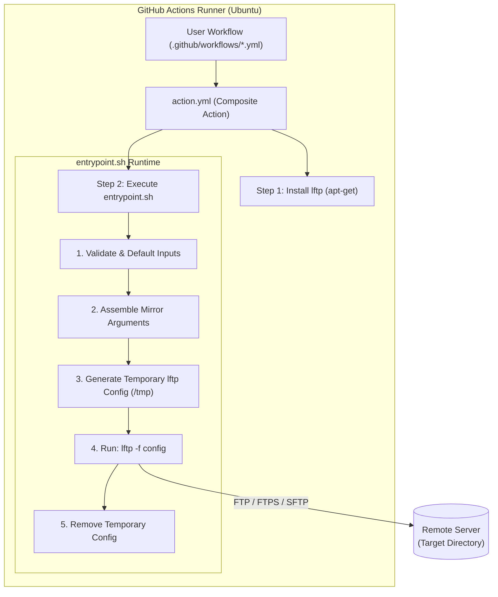
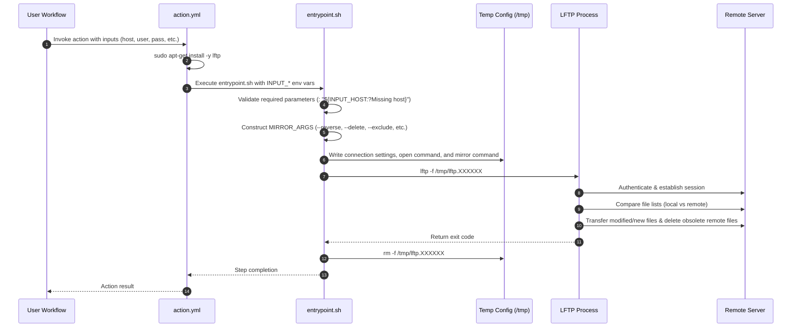

# LFTP Deploy Action — Technical Reference & Codebase Review

Comprehensive technical reference, architecture breakdown, and code review for [lftp-deploy-action](file:///Users/ram/development/github/lftp-deploy-action).

---

## Table of Contents

1. [Project Overview](#project-overview)
2. [Architecture & Workflow](#architecture--workflow)
   - [Workflow Sequence](#workflow-sequence)
   - [Component Hierarchy](#component-hierarchy)
3. [File-by-File Code Review](#file-by-file-code-review)
   - [`action.yml`](#actionyml)
   - [`entrypoint.sh`](#entrypointsh)
   - [`README.md`](#readmemd)
   - [`.gitignore`](#gitignore)
4. [Identified Issues & Vulnerabilities](#identified-issues--vulnerabilities)
   - [Critical Bug: Direction Inversion & Data Loss on `verbose: false`](#1-critical-direction-inversion--data-loss-on-verbose-false)
   - [Critical Bug: Invalid LFTP Authentication Command](#2-critical-invalid-lftp-authentication-command)
   - [Security Vulnerability: Credential Leakage via Missing Trap](#3-security-credential-leakage-via-missing-trap)
   - [Security Vulnerability: Hardcoded Insecure SSL Verification](#4-security-hardcoded-insecure-ssl-verification)
   - [Robustness Defect: Insecure Heredoc & Path Quoting](#5-robustness-insecure-heredoc--path-quoting)
   - [Performance & Compatibility: Slow and Fragile Runner Setup](#6-performance--compatibility-slow-and-fragile-runner-setup)
   - [Metadata Inconsistencies & Missing Files](#7-metadata-inconsistencies--missing-files)
5. [Input Parameter Reference](#input-parameter-reference)
6. [LFTP Configuration & Protocol Matrix](#lftp-configuration--protocol-matrix)
7. [Recommended Hardened Implementation](#recommended-hardened-implementation)
   - [Patched `entrypoint.sh`](#patched-entrypointsh)
   - [Patched `action.yml`](#patched-actionyml)
8. [Production Workflow Recipes](#production-workflow-recipes)

---

## Project Overview

`lftp-deploy-action` is a GitHub Composite Action that synchronizes build outputs or workspace directories to remote servers using `lftp mirror --reverse`. It abstracts file transport across FTP, FTPS, and SFTP protocols, providing rsync-like synchronization capabilities (delta transfers, file deletion, and exclusion filtering).

- **Action Type**: GitHub Composite Action (`runs.using: "composite"`)
- **Target Environment**: Ubuntu/Debian Linux GitHub Actions runners (requires `apt-get`)
- **Underlying Engine**: [LFTP](https://lftp.yar.ru/) (command-line file transfer program supporting FTP, FTPS, SFTP, HTTP, and FISH)

---

## Architecture & Workflow

### Component Hierarchy



### Workflow Sequence



---

## File-by-File Code Review

### [`action.yml`](file:///Users/ram/development/github/lftp-deploy-action/action.yml)

| Field / Area | Code Line | Finding & Analysis |
| :--- | :--- | :--- |
| **Author Name** | [Line 6](file:///Users/ram/development/github/lftp-deploy-action/action.yml#L6) | Lists author as `"arroWebs"`, whereas [`README.md`](file:///Users/ram/development/github/lftp-deploy-action/README.md#L13) references `ramzlab000/lftp-deploy-action@main`. |
| **Inputs Declared** | [Lines 8–48](file:///Users/ram/development/github/lftp-deploy-action/action.yml#L8-L48) | Defines 11 inputs. Note that `verbose` is defined with default `"true"`, but is missing from [`README.md`](file:///Users/ram/development/github/lftp-deploy-action/README.md#L25-L39). Missing port parameter `port` (crucial for custom SFTP/FTPS ports). |
| **Package Installation** | [Lines 52–57](file:///Users/ram/development/github/lftp-deploy-action/action.yml#L52-L57) | Runs `sudo apt-get update -qq && sudo apt-get install -y lftp` on every step. This slows workflows by 15–40s and causes builds to fail if external package mirrors experience transient outages. It also restricts runners strictly to Ubuntu/Debian. |
| **Environment Passing** | [Lines 60–71](file:///Users/ram/development/github/lftp-deploy-action/action.yml#L60-L71) | Maps inputs to `INPUT_*` environment variables for [`entrypoint.sh`](file:///Users/ram/development/github/lftp-deploy-action/entrypoint.sh). Clean and adheres to standard GitHub Action parameter forwarding. |

---

### [`entrypoint.sh`](file:///Users/ram/development/github/lftp-deploy-action/entrypoint.sh)

| Area | Code Line | Finding & Analysis |
| :--- | :--- | :--- |
| **Shell Strict Mode** | [Line 2](file:///Users/ram/development/github/lftp-deploy-action/entrypoint.sh#L2) | `set -euo pipefail` ensures any unhandled error or unset variable terminates the script immediately. |
| **Input Validation** | [Lines 4–17](file:///Users/ram/development/github/lftp-deploy-action/entrypoint.sh#L4-L17) | Concise Bash parameter expansion assertions (`: "${INPUT_HOST:?Missing host}"`). If any required parameter is missing, script aborts with a meaningful message. |
| **Flag Assignment Bug** | [Lines 23–26](file:///Users/ram/development/github/lftp-deploy-action/entrypoint.sh#L23-L26) | **CRITICAL BUG**: Line 23 initializes `MIRROR_ARGS="--reverse --verbose"`. Line 26 executes `[[ "${INPUT_VERBOSE}" != "true" ]] && MIRROR_ARGS="--quiet"`. If `verbose: false`, `MIRROR_ARGS` is overwritten without `--reverse`. As a result, LFTP reverses sync direction (downloads remote files to local runner). If combined with `delete: true`, it deletes local files! |
| **Exclude Parsing** | [Lines 32–37](file:///Users/ram/development/github/lftp-deploy-action/entrypoint.sh#L32-L37) | Splits comma-separated patterns. Does not trim leading or trailing spaces from glob items (e.g. `"*.js, *.css"` leaves a space before `*.css`). |
| **Log Output Mismatch** | [Lines 40–41](file:///Users/ram/development/github/lftp-deploy-action/entrypoint.sh#L40-L41) | Outputs an inline `-e` command that does not reflect actual execution settings (`ftp:passive-mode`, `ssl:verify-certificate`, `sftp:auto-confirm`). |
| **Authentication Syntax** | [Lines 49–50](file:///Users/ram/development/github/lftp-deploy-action/entrypoint.sh#L49-L50) | **CRITICAL BUG**: The script outputs `open ${INPUT_PROTOCOL}://${INPUT_USERNAME}@${INPUT_HOST}` on line 49 and `${INPUT_PASSWORD}` on line 50. In batch mode (`lftp -f`), LFTP treats line 50 as an internal command rather than a password. Authentication fails with an `unknown command` error. |
| **Missing Exit Trap** | [Lines 44 & 58](file:///Users/ram/development/github/lftp-deploy-action/entrypoint.sh#L44-L58) | `LFTP_CONFIG=$(mktemp)` creates a config containing plaintext credentials. Because `set -e` is active, if `lftp -f` exits with an error on line 56, line 58 (`rm -f "${LFTP_CONFIG}"`) is never executed, leaving secrets on disk. |

---

### [`README.md`](file:///Users/ram/development/github/lftp-deploy-action/README.md)

| Area | Code Line | Finding & Analysis |
| :--- | :--- | :--- |
| **Repository Path** | [Line 13](file:///Users/ram/development/github/lftp-deploy-action/README.md#L13) | `uses: ramzlab000/lftp-deploy-action@main` mismatch with `action.yml` author `"arroWebs"`. |
| **Inputs Table** | [Lines 27–39](file:///Users/ram/development/github/lftp-deploy-action/README.md#L27-L39) | Does not document `verbose` (declared in `action.yml`). Default value for `exclude` listed as `""` (empty string). |
| **License Link** | [Line 48](file:///Users/ram/development/github/lftp-deploy-action/README.md#L48) | Hyperlinks to `[MIT License](LICENSE)`, but no `LICENSE` file exists in the repository. |

---

### [`.gitignore`](file:///Users/ram/development/github/lftp-deploy-action/.gitignore)

Comprehensive ignore file covering OS files, editor configs (`.vscode`, `.idea`), logs, temp files, build outputs (`dist/`, `build/`, `out/`), `node_modules`, and environment files (`.env*`).

---

## Identified Issues & Vulnerabilities

### 1. [CRITICAL] Direction Inversion & Data Loss on `verbose: false`

#### Root Cause
In [`entrypoint.sh`](file:///Users/ram/development/github/lftp-deploy-action/entrypoint.sh#L23-L26):
```bash
MIRROR_ARGS="--reverse --verbose"

# Add features
[[ "${INPUT_VERBOSE}" != "true" ]] && MIRROR_ARGS="--quiet"
```
When `INPUT_VERBOSE` is set to `false`, `MIRROR_ARGS` is assigned directly to `"--quiet"`. This strips the `--reverse` (`-R`) flag.

#### Consequences
- In LFTP, `mirror` (without `--reverse`) downloads files from the remote server into the local runner directory.
- If `delete: true` is configured, LFTP will delete local workspace files that do not exist on the remote server!
- Instead of deploying code, the action downloads remote data and potentially destroys local build artifacts.

#### Remediation
Separate reverse mode from verbosity flags:
```bash
MIRROR_ARGS="--reverse"

if [[ "${INPUT_VERBOSE}" == "true" ]]; then
  MIRROR_ARGS="${MIRROR_ARGS} --verbose"
else
  MIRROR_ARGS="${MIRROR_ARGS} --quiet"
fi
```

---

### 2. [CRITICAL] Invalid LFTP Authentication Command

#### Root Cause
In [`entrypoint.sh`](file:///Users/ram/development/github/lftp-deploy-action/entrypoint.sh#L49-L50):
```bash
open ${INPUT_PROTOCOL}://${INPUT_USERNAME}@${INPUT_HOST}
${INPUT_PASSWORD}
```

#### Consequences
- In non-interactive script mode (`lftp -f <file>`), LFTP processes the file line-by-line as commands.
- It does **not** treat the subsequent line as an interactive password prompt input.
- Line 50 is evaluated as an LFTP command. LFTP fails with an error:
  `LFTP: <password>: Unknown command`
- The connection fails authentication or hangs.

#### Remediation
Use standard LFTP authentication commands:
```bash
open -u "${INPUT_USERNAME},${INPUT_PASSWORD}" "${INPUT_PROTOCOL}://${INPUT_HOST}"
```
or authenticate via the `user` command:
```bash
open "${INPUT_PROTOCOL}://${INPUT_HOST}"
user "${INPUT_USERNAME}" "${INPUT_PASSWORD}"
```

---

### 3. [SECURITY] Credential Leakage via Missing Trap

#### Root Cause
In [`entrypoint.sh`](file:///Users/ram/development/github/lftp-deploy-action/entrypoint.sh#L44-L58):
```bash
LFTP_CONFIG=$(mktemp)
# ... credentials written to LFTP_CONFIG ...
lftp -f "${LFTP_CONFIG}"
rm -f "${LFTP_CONFIG}"
```

#### Consequences
- Under `set -e`, any command returning a non-zero exit code halts execution immediately.
- If `lftp -f` fails (network failure, bad host, auth failure), the script exits at line 56.
- Line 58 is never executed. The file `/tmp/tmp.XXXXXXXXXX` containing the username and password remains in plaintext on the runner filesystem.
- In shared runner environments or self-hosted runners, this exposes credentials to subsequent steps or jobs.

#### Remediation
Register an `EXIT` trap immediately after generating the temporary file:
```bash
LFTP_CONFIG=$(mktemp)
trap 'rm -f "${LFTP_CONFIG:-}"' EXIT
chmod 600 "${LFTP_CONFIG}"
```

---

### 4. [SECURITY] Hardcoded Insecure SSL Verification

#### Root Cause
In [`entrypoint.sh`](file:///Users/ram/development/github/lftp-deploy-action/entrypoint.sh#L47):
```bash
set ssl:verify-certificate no
```

#### Consequences
- Disabling certificate verification exposes all FTPS connections to Man-In-The-Middle (MITM) attacks.
- Credentials and transmitted source files can be intercepted or altered in transit.

#### Remediation
Expose `verify_ssl` as an input parameter in `action.yml` (defaulting to `true` or configurable):
```bash
if [[ "${INPUT_VERIFY_SSL:-false}" == "true" ]]; then
  echo "set ssl:verify-certificate yes" >> "${LFTP_CONFIG}"
else
  echo "set ssl:verify-certificate no" >> "${LFTP_CONFIG}"
fi
```

---

### 5. [ROBUSTNESS] Insecure Heredoc & Path Quoting

#### Root Cause
In [`entrypoint.sh`](file:///Users/ram/development/github/lftp-deploy-action/entrypoint.sh#L45-L53):
```bash
cat > "${LFTP_CONFIG}" << EOF
...
mirror ${MIRROR_ARGS} ${INPUT_LOCAL_DIR} ${INPUT_REMOTE_DIR}
bye
EOF
```

#### Consequences
- If `INPUT_LOCAL_DIR` or `INPUT_REMOTE_DIR` contains spaces or special characters (e.g. `./build output/`), LFTP splits on whitespace, failing the transfer.
- If passwords contain double quotes, backslashes, or variable expansion characters, the heredoc and LFTP parser can break.

#### Remediation
Quote the paths inside the LFTP script:
```bash
mirror ${MIRROR_ARGS} "${INPUT_LOCAL_DIR}" "${INPUT_REMOTE_DIR}"
```

---

### 6. [PERFORMANCE & COMPATIBILITY] Slow and Fragile Runner Setup

#### Root Cause
In [`action.yml`](file:///Users/ram/development/github/lftp-deploy-action/action.yml#L54-L56):
```yaml
run: |
  sudo apt-get update -qq
  sudo apt-get install -y lftp
```

#### Consequences
- `apt-get update -qq` synchronizes all Ubuntu package indices, adding 15 to 40 seconds to every build.
- If any Ubuntu PPA or mirror is slow or temporarily down, the deployment fails before doing anything.
- The action will error immediately on macOS (`macos-latest`) or Windows runners due to missing `apt-get`.

#### Remediation
Check whether `lftp` is already available before triggering package installation, and avoid full repository updates:
```yaml
run: |
  if ! command -v lftp >/dev/null 2>&1; then
    sudo apt-get update -qq
    sudo apt-get install -y --no-install-recommends lftp
  fi
```

---

### 7. Metadata Inconsistencies & Missing Files

1. **Missing `LICENSE` File**: `README.md` refers to an MIT license, but no `LICENSE` file is committed.
2. **Missing Input Documentation**: `verbose` is defined in `action.yml` but omitted in `README.md`.
3. **Missing Port Option**: Port cannot be specified independently. While some servers accept `host:port`, having an explicit `port` parameter avoids syntax errors.
4. **Author Mismatch**: `arroWebs` vs `ramzlab000`.

---

## Input Parameter Reference

| Input Name | Type | Required | Default | Description | Impact & Notes |
| :--- | :--- | :--- | :--- | :--- | :--- |
| `host` | `string` | **Yes** | — | Server hostname or IP address (e.g. `ftp.example.com`). | Target server address. Can include port (`host:port`) if supported by protocol. |
| `username` | `string` | **Yes** | — | Authentication username. | Stored in GitHub Secrets (`secrets.FTP_USER`). |
| `password` | `string` | **Yes** | — | Authentication password. | Stored in GitHub Secrets (`secrets.FTP_PASS`). Sensitive. |
| `remote_dir` | `string` | **Yes** | — | Target remote path (e.g. `/public_html` or `html`). | Target directory on remote server. Created if it does not exist. |
| `protocol` | `string` | No | `ftp` | Transfer protocol: `ftp`, `ftps`, or `sftp`. | Determines connection handler in LFTP. |
| `local_dir` | `string` | No | `.` | Local source directory to upload. | Directory containing files to sync. |
| `delete` | `boolean` | No | `false` | Remove remote files not present locally. | Corresponds to `mirror --delete`. **Warning:** Deletes remote files! |
| `dry_run` | `boolean` | No | `false` | Simulate transfer without modifying remote. | Corresponds to `mirror --dry-run`. Safe for testing. |
| `exclude` | `string` | No | `""` | Comma-separated glob patterns to ignore. | Converted to `--exclude-glob <pattern>` for each token. |
| `only_newer`| `boolean` | No | `false` | Only transfer files with newer timestamp. | Corresponds to `mirror --only-newer`. Skips older/identical files. |
| `verbose` | `boolean` | No | `true` | Enables verbose transfer logging. | If `false`, passes `--quiet` to suppress progress. |

---

## LFTP Configuration & Protocol Matrix

| Protocol | LFTP Protocol Prefix | Default Port | Passive Mode | Certificate Validation | Auto Host Key Confirmation |
| :--- | :--- | :--- | :--- | :--- | :--- |
| **FTP** | `ftp://` | 21 | `set ftp:passive-mode yes` | N/A | N/A |
| **FTPS** | `ftps://` | 21 or 990 | `set ftp:passive-mode yes` | `set ssl:verify-certificate no` | N/A |
| **SFTP** | `sftp://` | 22 | N/A | N/A | `set sftp:auto-confirm yes` |

---

## Recommended Hardened Implementation

### Patched `entrypoint.sh`

```bash
#!/usr/bin/env bash
set -euo pipefail

# 1. Validate required inputs
: "${INPUT_HOST:?Missing host}"
: "${INPUT_USERNAME:?Missing username}"
: "${INPUT_PASSWORD:?Missing password}"
: "${INPUT_REMOTE_DIR:?Missing remote_dir}"

# 2. Defaults
: "${INPUT_PROTOCOL:=ftp}"
: "${INPUT_LOCAL_DIR:=.}"
: "${INPUT_DELETE:=false}"
: "${INPUT_DRY_RUN:=false}"
: "${INPUT_ONLY_NEWER:=false}"
: "${INPUT_VERBOSE:=true}"
: "${INPUT_EXCLUDE:=}"
: "${INPUT_VERIFY_SSL:=false}"

echo "::group::LFTP Deploy to ${INPUT_PROTOCOL}://${INPUT_HOST}${INPUT_REMOTE_DIR}"

# 3. Build mirror arguments safely
# Always keep --reverse for upload direction
MIRROR_ARGS="--reverse"

if [[ "${INPUT_VERBOSE}" == "true" ]]; then
  MIRROR_ARGS="${MIRROR_ARGS} --verbose"
else
  MIRROR_ARGS="${MIRROR_ARGS} --quiet"
fi

if [[ "${INPUT_DELETE}" == "true" ]]; then
  MIRROR_ARGS="${MIRROR_ARGS} --delete"
fi

if [[ "${INPUT_DRY_RUN}" == "true" ]]; then
  MIRROR_ARGS="${MIRROR_ARGS} --dry-run"
fi

if [[ "${INPUT_ONLY_NEWER}" == "true" ]]; then
  MIRROR_ARGS="${MIRROR_ARGS} --only-newer"
fi

# 4. Handle exclude patterns (trimming spaces)
if [[ -n "${INPUT_EXCLUDE}" ]]; then
  IFS=',' read -ra EXCLUDES <<< "${INPUT_EXCLUDE}"
  for pattern in "${EXCLUDES[@]}"; do
    trimmed_pattern="$(echo "${pattern}" | xargs)"
    if [[ -n "${trimmed_pattern}" ]]; then
      MIRROR_ARGS="${MIRROR_ARGS} --exclude-glob ${trimmed_pattern}"
    fi
  done
fi

echo "📤 Syncing ${INPUT_LOCAL_DIR} → ${INPUT_REMOTE_DIR}"

# 5. Create secure temp config with cleanup trap
LFTP_CONFIG="$(mktemp)"
trap 'rm -f "${LFTP_CONFIG:-}"' EXIT
chmod 600 "${LFTP_CONFIG}"

# 6. Generate configuration file with valid LFTP authentication
cat > "${LFTP_CONFIG}" << EOF
set ftp:passive-mode yes
set sftp:auto-confirm yes
set ssl:verify-certificate $(if [[ "${INPUT_VERIFY_SSL}" == "true" ]]; then echo "yes"; else echo "no"; fi)
open -u "${INPUT_USERNAME},${INPUT_PASSWORD}" "${INPUT_PROTOCOL}://${INPUT_HOST}"
mirror ${MIRROR_ARGS} "${INPUT_LOCAL_DIR}" "${INPUT_REMOTE_DIR}"
bye
EOF

# 7. Execute lftp
lftp -f "${LFTP_CONFIG}"

echo "::endgroup::"
echo "✅ Deployment complete!"
```

---

### Patched `action.yml`

```yaml
name: "LFTP Deploy"
description: "Deploy files to FTP/FTPS/SFTP servers using lftp mirror (rsync-like sync)"
branding:
  icon: upload-cloud
  color: blue
author: "arroWebs"

inputs:
  host:
    description: "Host (ftp.example.com)"
    required: true
  username:
    description: "Username"
    required: true
  password:
    description: "Password"
    required: true
  protocol:
    description: "ftp, ftps, or sftp"
    required: false
    default: "ftp"
  local_dir:
    description: "Local directory to sync"
    required: false
    default: "."
  remote_dir:
    description: "Remote target directory"
    required: true
  delete:
    description: "Delete remote files not present locally"
    required: false
    default: "false"
  dry_run:
    description: "Show what would be done without making changes"
    required: false
    default: "false"
  exclude:
    description: "Comma-separated exclude patterns"
    required: false
  only_newer:
    description: "Only transfer newer files"
    required: false
    default: "false"
  verbose:
    description: "Verbose output"
    required: false
    default: "true"
  verify_ssl:
    description: "Verify SSL certificates for FTPS (true or false)"
    required: false
    default: "false"

runs:
  using: "composite"
  steps:
    - name: Install lftp
      shell: bash
      run: |
        if ! command -v lftp >/dev/null 2>&1; then
          sudo apt-get update -qq
          sudo apt-get install -y --no-install-recommends lftp
        fi

    - name: Deploy with lftp
      shell: bash
      env:
        INPUT_HOST: ${{ inputs.host }}
        INPUT_USERNAME: ${{ inputs.username }}
        INPUT_PASSWORD: ${{ inputs.password }}
        INPUT_PROTOCOL: ${{ inputs.protocol }}
        INPUT_LOCAL_DIR: ${{ inputs.local_dir }}
        INPUT_REMOTE_DIR: ${{ inputs.remote_dir }}
        INPUT_DELETE: ${{ inputs.delete }}
        INPUT_DRY_RUN: ${{ inputs.dry_run }}
        INPUT_EXCLUDE: ${{ inputs.exclude }}
        INPUT_ONLY_NEWER: ${{ inputs.only_newer }}
        INPUT_VERBOSE: ${{ inputs.verbose }}
        INPUT_VERIFY_SSL: ${{ inputs.verify_ssl }}
      run: bash "${{ github.action_path }}/entrypoint.sh"
```

---

## Production Workflow Recipes

### Recipe 1: Static Site / Frontend Deployment (FTPS)

```yaml
name: Deploy Production Frontend

on:
  push:
    branches: [main]

jobs:
  deploy:
    runs-on: ubuntu-latest
    steps:
      - name: Checkout Code
        uses: actions/checkout@v4

      - name: Setup Node.js
        uses: actions/setup-node@v4
        with:
          node-version: 20
          cache: npm

      - name: Build Application
        run: |
          npm ci
          npm run build

      - name: Deploy to Hosting Server via FTPS
        uses: ramzlab000/lftp-deploy-action@main
        with:
          host: ${{ secrets.FTP_HOST }}
          username: ${{ secrets.FTP_USER }}
          password: ${{ secrets.FTP_PASS }}
          protocol: ftps
          local_dir: ./dist
          remote_dir: /public_html
          delete: true
          exclude: ".git/*, node_modules/*, *.log"
```

### Recipe 2: Secure SFTP Deployment with Dry-Run Check

```yaml
name: Dry-Run Verification on Pull Request

on:
  pull_request:
    branches: [main]

jobs:
  verify-deploy:
    runs-on: ubuntu-latest
    steps:
      - name: Checkout Code
        uses: actions/checkout@v4

      - name: Simulate SFTP Sync
        uses: ramzlab000/lftp-deploy-action@main
        with:
          host: sftp.example.com
          username: ${{ secrets.SFTP_USER }}
          password: ${{ secrets.SFTP_PASS }}
          protocol: sftp
          local_dir: ./build
          remote_dir: /var/www/app
          dry_run: true
          delete: true
```
